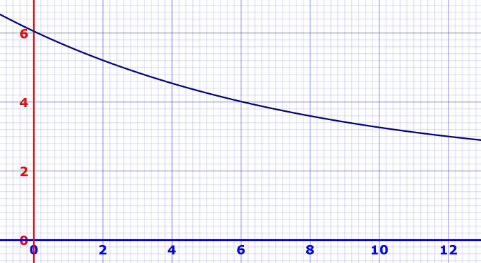

# FixWare

PLAY IT HERE! -> https://lagjara.itch.io/fixware

### *NOVEDAD:* Ahora el tiempo se va reduciendo cuantos más minijuegos completas.

## Lista de Minijuegos
- **mini1** : *Fix the meme!*
- **mini2** : *Repair the WiFi*
- **mini3** : *Repair ti*
- **mini4** : *Repair your sins*
- **mini5** : *Repair the Darkness!*
- **mini6** : *Repair the car!*
- **mini7** : *Recycle*
- **mini8** : *Repair the planet!*
- **mini9** : *Repair the TV!*
- **mini10** : *Restore happiness*

## Tareas pendientes
### Programming
- [x] *Reducción de tiempo progr
- [ ] *Añadir soporte para diferentes resoluciones*
- [ ] Check de tutorial: que desaparezca un poquito antes
- [ ] Ondas WiFi al completar
- [ ] Reparar Clicker que vomita errores
- [ ] Meme randomizer
- [ ] Desktop randomizer
	- [ ] 1~3 iconos
	- [ ] Posiciones aleatorias

#### Mecanicas de juego
  - [x] Clicar en 1 sitio 
  - [x] Mover 1 cosa a 1 sitio 
  - [ ] Esquivar cosas con el cursor *
  - [ ] Mover el mouse de determinada manera
  - [ ] Cut the rope

### Sonido
- [X] Sonidos fail (quitar "geimover!" y poner globito)
- [x] Musica punchimpum empieza cuando hay partida en marcha
- [x] Cambiar tambien la musica de la pantalla de GameOver
- [x] Musica mas tranquila para pantallas fuera de partida
- [ ] Mute Button
- [ ] Sonidos Recycle
- [ ] Sonidos Restore Meme
- [ ] Sonidos DonateButton

### Arte
- [ ] Botón reset con aspecto de botón reset
- [ ] Memes
- [ ] Icono Mute Music (Activado/Desactivado)
- [ ] Icono Mute Sounds (Acivado/Desactivado)

## ¡¡QUEREMOS MÁS MINIJUEGOS!!
